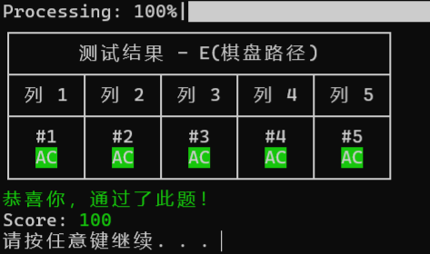
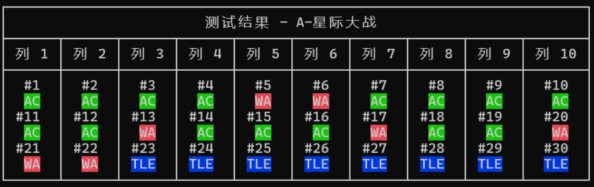
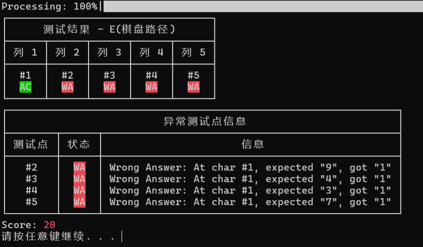

# PyJudge


一款有点好用的 Python 评测机。

支持自定义测试点输入输出和时间限制、详细调试信息显示等基本功能，并根据程序评测结果统计得分。

## 开始使用
### 环境需求：
 - Python 3 或更高版本
 - ```pip``` (Python包安装器)
### 安装
克隆此仓库
```shell
git clone https://github.com/async-cn/PyJudge.git
cd PyJudge
```
安装项目
```shell
pip install dist/pyjudge-0.1.0-py3-none-any.whl
```
## 使用方法
### 终端运行（推荐）
执行以下命令，将```<path>```替换为题目**目录**（即```judge.json```所在的目录）。
```shell
python -m pyjudge "<path>"
```

## 题目结构
具体示例见```example```目录

题目的文件结构如下（其中```.in```和```.ans```文件可选择不创建）
```text
my_problem/
├─judge.json
├─2.in
├─2.ans
└─my_program.py
```

```judge.json```的内容

其中```nodes```为测试点列表，可以直接输入数据或从文件读取。
```json
{
    "name": "我的题目",
    "program": "my_program",
    "nodes": [
    {
      "input": "7\n16\n5\n5",
      "ans": "48804"
    },
    {
      "file": {
          "input": "2.in",
          "ans": "2.ans"
      }
    }
  ]
}
```
## 实际使用例图



